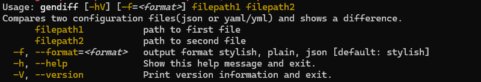
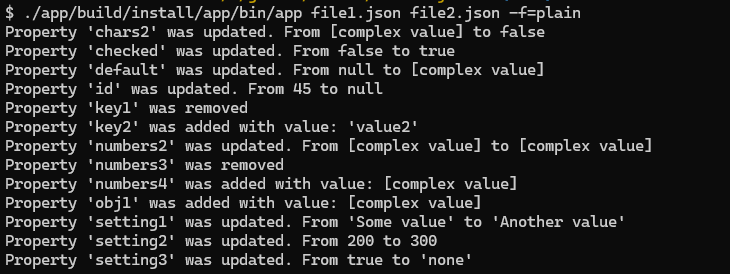
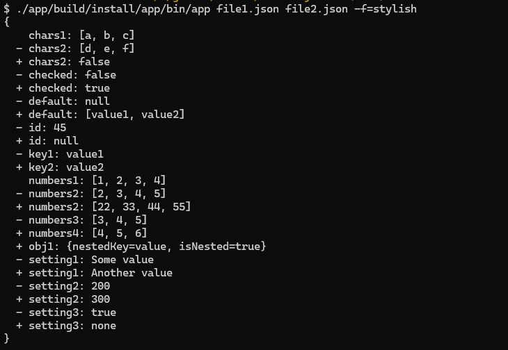

### Hexlet tests and linter status:
[](https://github.com/ArtMan-8/java-project-71/actions) [](https://codeclimate.com/github/ArtMan-8/java-project-71/maintainability) [](https://codeclimate.com/github/ArtMan-8/java-project-71/test_coverage)

<hr />

# Вычислитель отличий

Консольное приложение для сравнения двух файлов.
Сравнивать можно `json` и `yaml` файлы.


```bash
// собрать проект
make run-dist
````

```bash
// запустить линтинги и тесты
make test
```

```bash
// запустить утилиту
./app/build/install/app/bin/app
```

#### Справка по утилите


#### Вывод сравнения текстом


#### Вывод сравнения стилизованный

